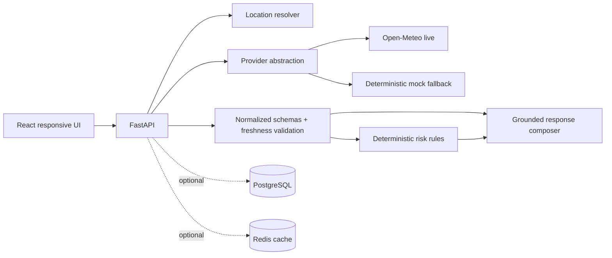

# Architecture

The database and Redis services are included in Compose for persistent history, subscriptions, and caching. This MVP holds those records in memory until repository wiring is enabled; it does not falsely claim persistence.
